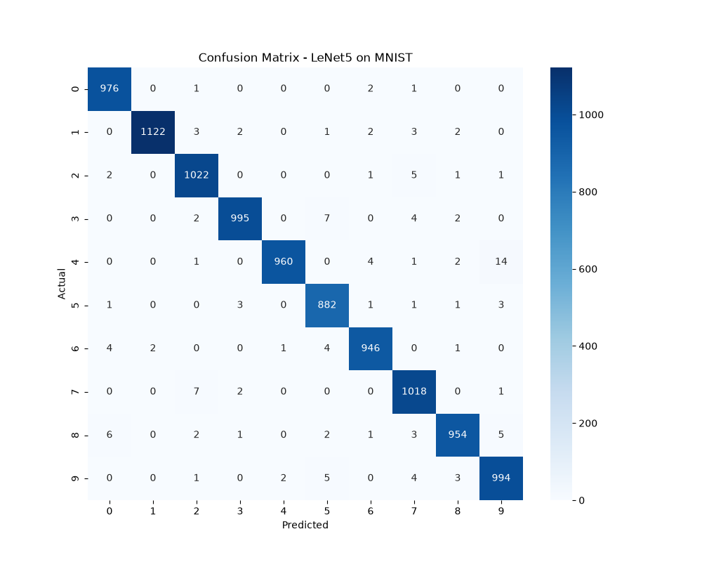
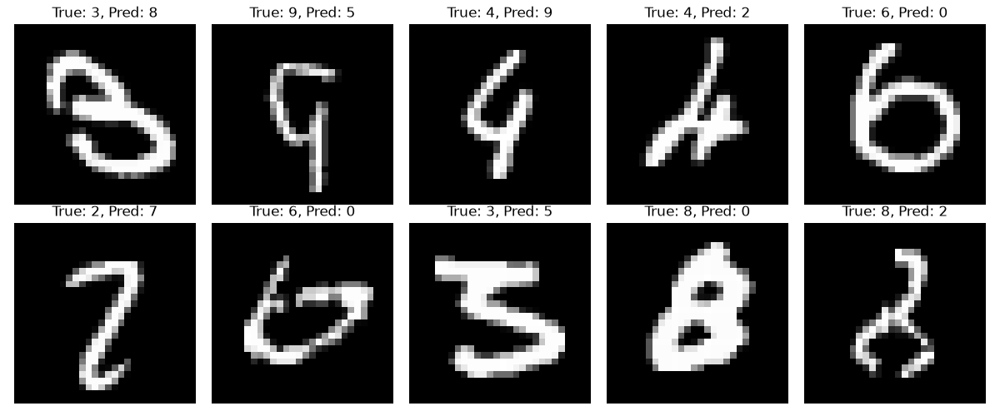

# LeNet-5 CNN: Research Paper Reproduction

A from-scratch implementation and reproduction of **LeNet-5** (LeCun et al., 1998) — the convolutional neural network architecture that helped pioneer modern deep learning. This project includes a hand-built NumPy implementation, a PyTorch refactor, model evaluation, and a live interactive web app for digit recognition.

## 🎯 Results

- **Test Accuracy:** 98.69% on MNIST (10,000 test images)
- **Train Accuracy:** 98.77%

## 🏗️ Project Structure

lenet-reproduction/

├── scratch/          # Pure NumPy implementation (Conv2D, MaxPool2D, FC, backprop)

├── pytorch/           # PyTorch refactor (model, training, evaluation)

├── app/               # Streamlit interactive digit recognizer

├── results/           # Confusion matrix, misclassified examples

└── notebooks/         # Exploratory notebooks

## 🧠 What This Project Demonstrates

1. **Forward & backward propagation implemented from scratch** in NumPy — including Conv2D, MaxPool2D, and Fully Connected layers with manual gradient computation
2. **Numerical stability debugging** — encountered and resolved exploding/vanishing gradients, dead ReLU neurons, and softmax overflow
3. **PyTorch implementation** — clean refactor using `nn.Module`, achieving 98.69% test accuracy
4. **Model interpretability** — confusion matrix analysis and misclassified example inspection
5. **Interactive deployment** — Streamlit app for real-time digit prediction

## 🏛️ Architecture

INPUT (28×28×1)

↓

Conv2D (6 filters, 5×5) → ReLU → MaxPool (2×2)

↓

Conv2D (16 filters, 5×5) → ReLU → MaxPool (2×2)

↓

Flatten → FC(120) → ReLU

↓

FC(84) → ReLU

↓

FC(10) → Output (digit probabilities)

## 📊 Confusion Matrix



## ❌ Misclassified Examples



Analysis of misclassified examples shows the model's errors are concentrated on genuinely ambiguous handwriting (e.g., 4s resembling 9s, 3s resembling 8s) rather than random failures — indicating the model learned meaningful digit features rather than memorizing training data.

## 🚀 Running the Project

### Setup
```bash
python -m venv venv
venv\Scripts\activate   # Windows
pip install -r requirements.txt
```

### Train the PyTorch model
```bash
cd pytorch
python train.py
```

### Evaluate the model
```bash
python evaluate.py
```

### Run the interactive app
```bash
cd app
streamlit run app.py
```

## 🛠️ Tech Stack

- **NumPy** — from-scratch CNN implementation
- **PyTorch** — production-style model training
- **Streamlit** — interactive web app
- **scikit-learn** — confusion matrix, metrics
- **Matplotlib/Seaborn** — visualizations

## 📚 Key Learnings

- Built and debugged backpropagation through Conv2D and MaxPool2D layers manually
- Diagnosed and resolved exploding gradients, dead neurons, and numerical instability (epsilon clipping, gradient clipping, learning rate tuning)
- Understood firsthand why frameworks like PyTorch use techniques like Kaiming initialization and Adam optimization
- Practiced end-to-end ML engineering: data loading, training, evaluation, interpretability, and deployment


## ⚠️ Known Limitation: Canvas Drawing Style

During interactive testing, digits with **open loops/curves** (e.g., 6, 8, 9 drawn 
as a single continuous stroke without fully closing the loop) were sometimes 
misclassified with lower confidence (50-85%) compared to MNIST's training 
distribution, which consists of pen-drawn digits with consistently closed loops.

**Example:** A "9" drawn with an open top loop was predicted as "0" 
(52.95% confidence) — the model's low confidence correctly signaled 
genuine ambiguity rather than confidently failing.

This is a well-documented characteristic of MNIST-trained models applied to 
freehand mouse/touchscreen input, since the stroke style differs from the 
original pen-based training data. Digits drawn with clear, closed strokes 
(matching MNIST's style) consistently achieve 90%+ confidence.

## 📖 Reference

LeCun, Y., Bottou, L., Bengio, Y., & Haffner, P. (1998). *Gradient-based learning applied to document recognition.* Proceedings of the IEEE.